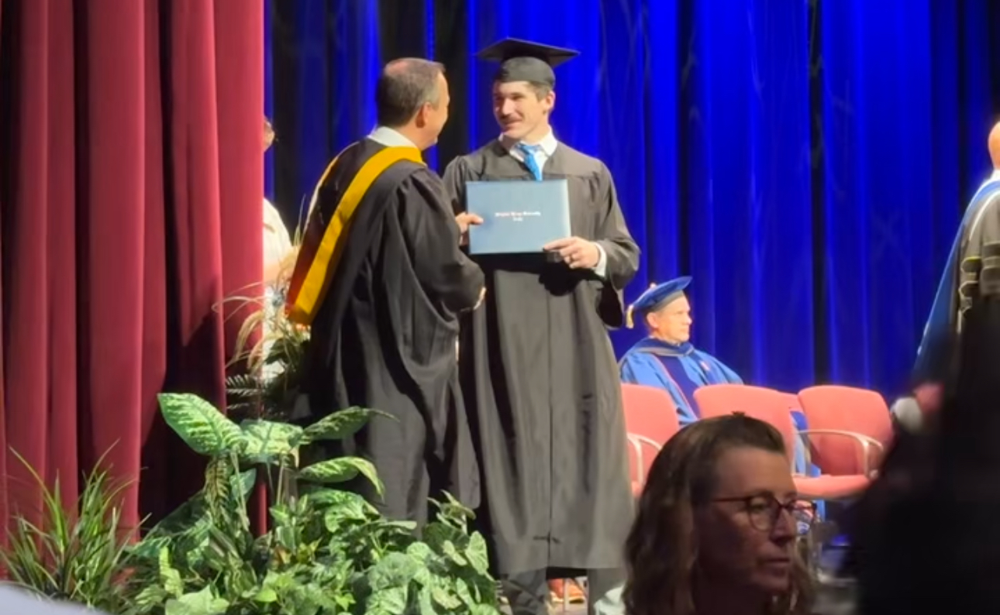

[LinkedIn](https://www.linkedin.com/in/jacobwcausey/)

There should be whitespace between paragraphs.

There should be whitespace between paragraphs. We recommend including a README, or a file with information about your project.

# Professional Summary

Dedicated and detail-oriented IT professional with a Bachelor’s degree in Computer Information Technology and hands-on experience in network engineering and risk analysis. Proficient in AWS, Azure, and various network systems. Adept at troubleshooting, implementing security best practices, and collaborating with cross-functional teams to deliver technology solutions.

### Certifications

<dl>
<dt>CompTIA</dt>
<dd>Security+</dd>
<dt>AWS</dt>
<dd>n/a</dd>
<dt>Google</dt>
<dd>Google CyberSecurity</dd>
<dt>ISC2</dt>
<dd>n/a</dd>
</dl>

## Cyber Security Projects

> Insert Link to Sentinel Project Here.
>
> When something is important enough, you do it even if the odds are not in your favor.

### Header 3

### Large image

